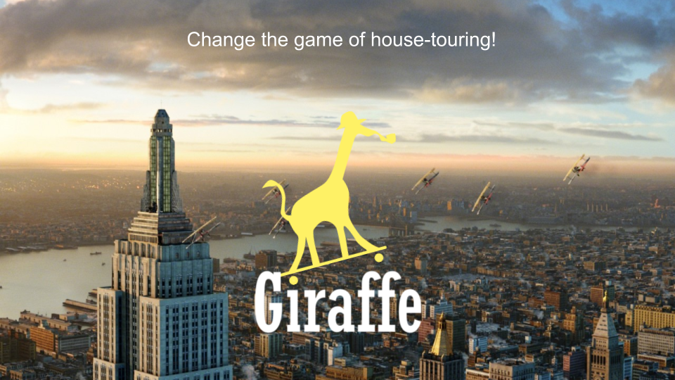
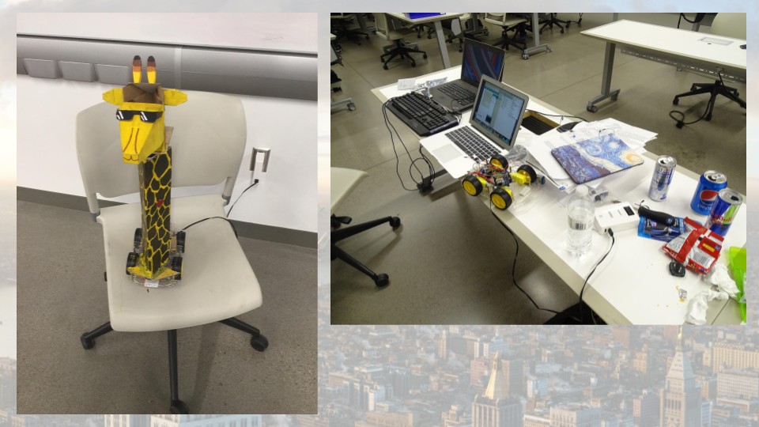
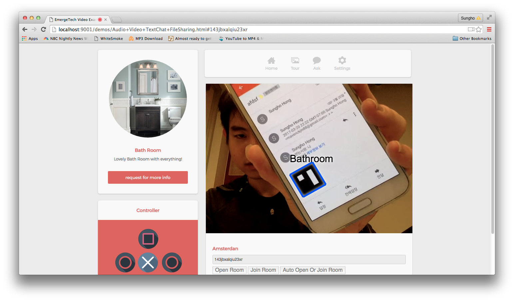

# Project Giraffe

Project Giraffe is a remote control car controlled on web and send streamline videos to web-users. This inter-disciplinary project is made among experts pursuing H/W, S/W and art,
 ultimately winning the first place in Emergen-Tech Hackathon.

 

1. Related links for the project Giraffe 
 - [article link](https://asunow.asu.edu/20170322-creativity-asu-wide-hackathon-calls-student-innovators-all-backgrounds)
 - [project link](https://devpost.com/software/etech_hackathon_2017)

 
 

2. Tools used for development
 - Arduinio Yun (Used for developing the RC vehicle)
 - Google App Engine python (Sending control signals from web to RC vehicle)
 - Node.js with heroku (Sending video streamline from RC vehicle to web)
 - Implement image pattern recognizition with javascript
 - Converting the video image from video to web-canvas

 
 
 
 
 

