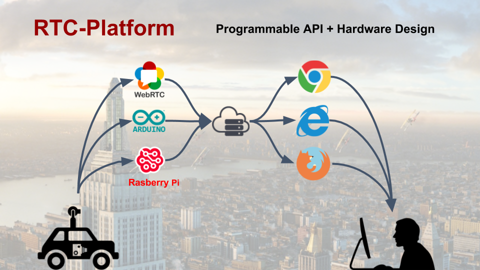
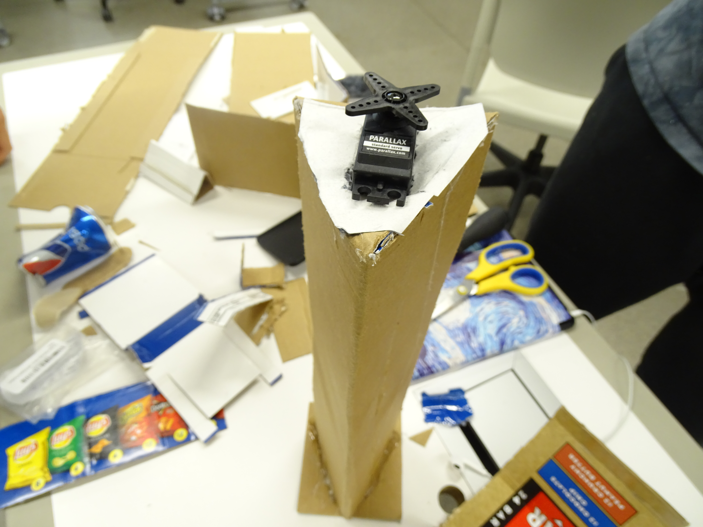

# Project Giraffe

Project giraffe is a creation made among H/W, S/W and art. 
The project won the first place in Emergen-Tech Hackathon

 

Related links for this project are listed below 
 - [article link](https://asunow.asu.edu/20170322-creativity-asu-wide-hackathon-calls-student-innovators-all-backgrounds)
 - [project link](https://devpost.com/software/etech_hackathon_2017)

